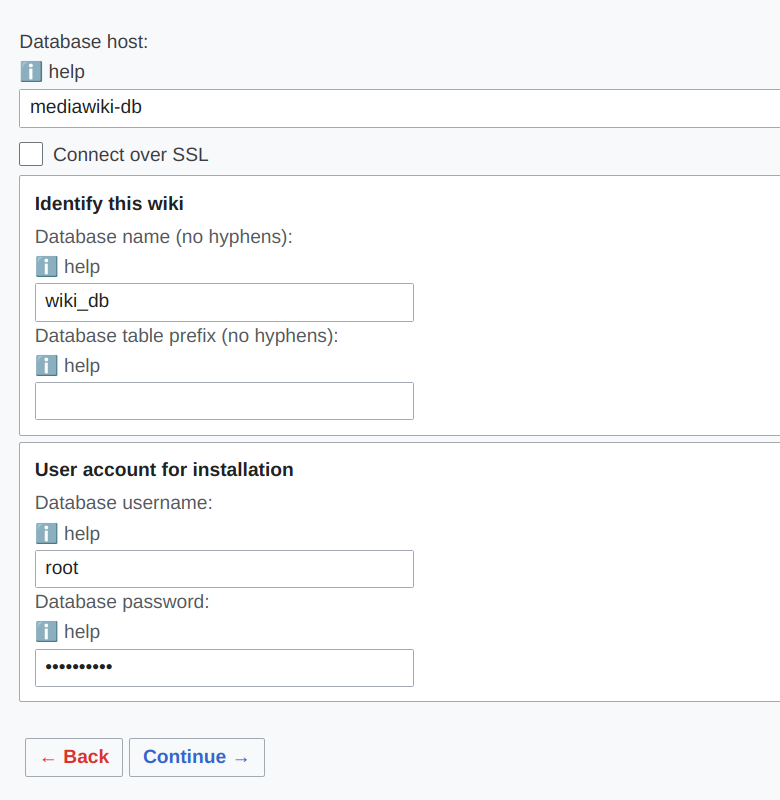

# Instalación de MediaWiki con Docker-Compose

## Prerequisitos

- Debe estar instalado Docker
- Debe estar instalado Docker Compose

## Instalación

1. Clonar este repositorio  
```bash 
git clone https://github.com/tiernogalvan/docker-compose-scripts.git
``` 
2. Abrir una terminal y navegar hasta la carpeta wordpress
```bash 
mkdir ~/mediawiki-content
cd docker-compose-scripts/mediawiki
```
3. (Opcional) Editar la configuración del fichero compose.yml
4. Crear el stack ejecutando
```bash 
docker compose up -d
```
5. Entra el la dirección http://localhost:8082 y sigue los pasos de la instalación. Durante la instalación hay que especificar el password de root (`Nohay2sin3`), el host de la base de datos `mediawiki-db` y el nombre de la base de datos `wiki_db`



Una vez terminada la configuración, se descarga el fichero `LocalSettings.php`

6. Desde la terminal vamos a copiar `LocalSettings.php` dentro del contendor de MediaWiki. Para ello, ejecuta el siguiente comando estando en el directorio `docker-compose-scripts/mediawiki`
```bash 
docker compose cp ~/Descargas/LocalSettings.php mediawiki:/var/www/html/LocalSettings.php
```
*NOTA* El directorio de descargas podría ser `Downloads` en algunos sistemas, si no funciona el comando anterior prueba con este otro
```bash 
docker compose cp ~/Downloads/LocalSettings.php mediawiki:/var/www/html/LocalSettings.php
```

Después de esto ya puedes abrir la wiki

Los puertos son:
- MediaWiki: http://localhost:8082
- PhPMyAdmin: http://localhost:8280

## Editar los archivos desde un editor del host

Si deseas editar los archivos creados por MediaWiki directamente en un editor primero debes dar permisos al usuario del host par modificar los mismos. Para ello, abre una terminal y ejecuta lo siguiente 
```bash 
cd ~/docker-compose-scripts/mediawiki
docker compose exec mediawiki chmod 777 -R /var/www/html/
```